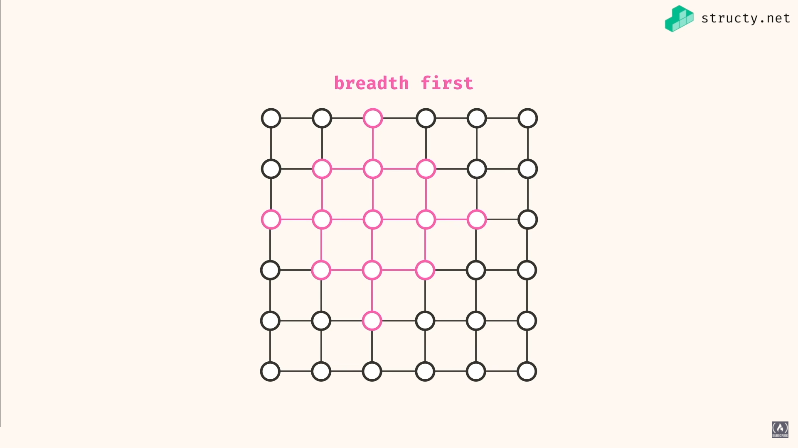
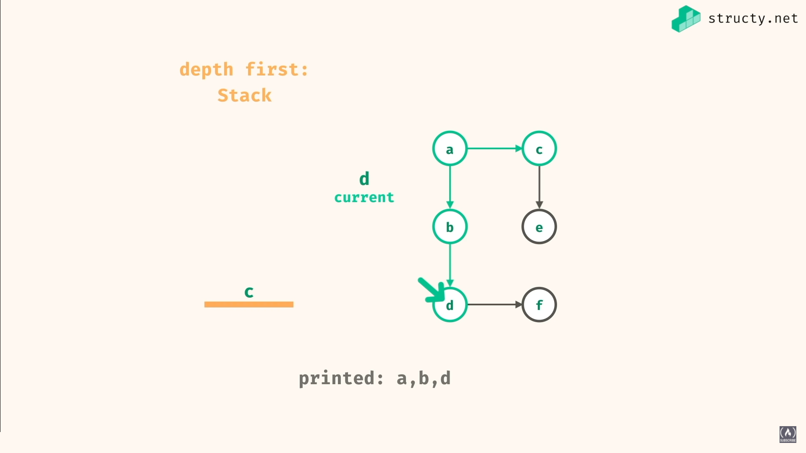
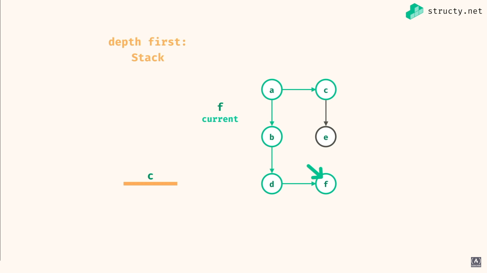
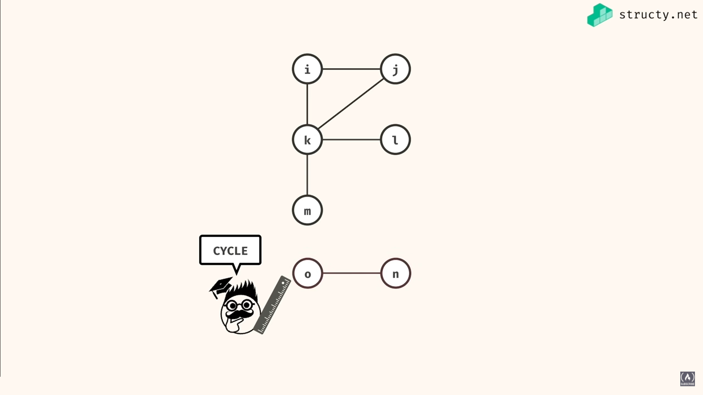
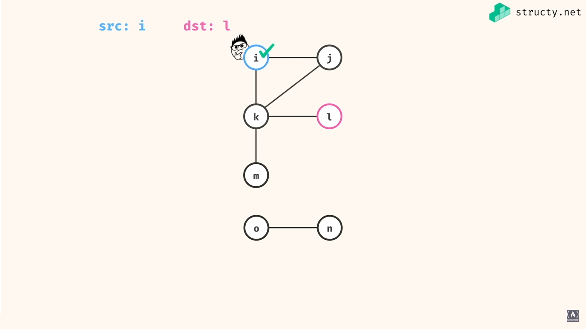
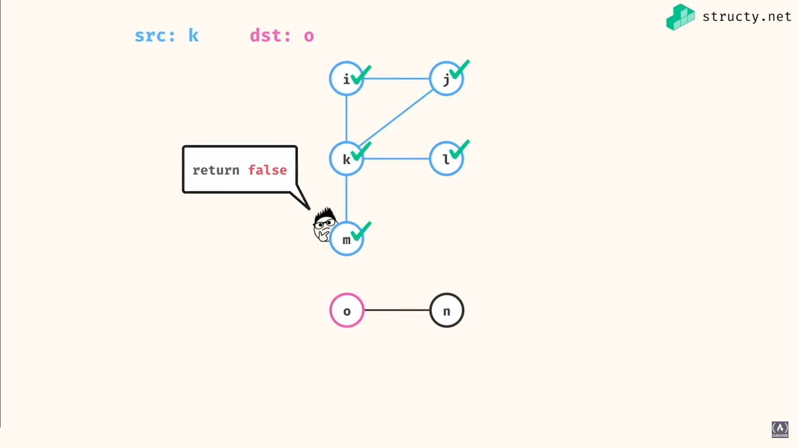

# Graph Algorithms for Technical Interviews - freeCodeCamp

### Reference: https://youtu.be/tWVWeAqZ0WU

<br>

|  | 
| ----------------------- | -----------------
|  | G

- Depth first: `Stack`
- Breadth first: `Queue`

## Depth

|   | 
| ------------- | -------------
|  |  
|  | 

## Breadth

|  | 
| -------------------------- | ------------
|  | 

<br>

## Depth first traversal

### JavaScript

```js
const depthFirstPrint = (graph, source) => {
    const stack = [source];

    while (stack.length > 0) {
        const current = stack.pop();
        console.log(current);
        for (let neighbor of graph[current]) {
            stack.push(neighbor);
        }
    }
};

const depthFirstRecursive = (graph, source) => {
    console.log(source);
    for (let neighbor of graph[source]) {
        depthFirstRecursive(graph, neighbor);
    };
};

const graph = {
    a: ['b', 'c'],
    b: ['d'],
    c: ['e'],
    d: ['f'],
    e: [],
    f: []
};


depthFirstPrint(graph, 'a'); // acebdf
console.log();
depthFirstRecursive(graph, 'a'); // abdfce
```

###  C#

```cs
using System;
using System.Collections.Generic;

void DepthFirstPrint(Dictionary<char, List<char>> graph, char source)
{
    Stack<char> stack = new Stack<char>();
    stack.Push(source);
    while (stack.Count > 0)
    {
        char current = stack.Pop();
        Console.Write(current + ", ");
        foreach (char neighbor in graph[current])
        {
            stack.Push(neighbor);
        }
    }
}

void DepthFirstRecursive(Dictionary<char, List<char>> graph, char source)
{
    Console.Write(source + ", ");
    foreach (char neighbor in graph[source])
    {
        DepthFirstRecursive(graph, neighbor);
    }
}

Dictionary<char, List<char>> graph = new Dictionary<char, List<char>>()
{
    ['a'] = new List<char>() { 'b', 'c' },
    ['b'] = new List<char>() { 'd' },
    ['c'] = new List<char>() { 'e' },
    ['d'] = new List<char>() { 'f' },
    ['e'] = new List<char>(),
    ['f'] = new List<char>()
};

DepthFirstPrint(graph, 'a'); //acebdf
Console.WriteLine();
DepthFirstRecursive(graph, 'a'); //abdfce
```

## Breadth first traversal

###  JavaScript

```js
const breadthFirstPrint = (graph, source) => {
    const queue = [source];
    while (queue.length > 0) {
        const current = queue.shift();
        console.log(current);
        for (let neighbor of graph[current]) {
            queue.push(neighbor);
        }
    }
};

const graph = {
    a: ['b', 'c'],
    b: ['d'],
    c: ['e'],
    d: ['f'],
    e: [],
    f: []
};

breadthFirstPrint(graph, 'a'); // abcdef
```

### C#

```cs
using System;
using System.Collections.Generic;

void BreadthFirstPrint(Dictionary<char, List<char>> graph, char source)
{
    Queue<char> queue = new Queue<char>();
    queue.Enqueue(source);
    while (queue.Count > 0)
    {
        char current = queue.Dequeue();
        Console.Write(current + ", ");
        foreach (char neighbor in graph[current])
        {
            queue.Enqueue(neighbor);
        }
    }
    Console.WriteLine(string.Join(", ", queue));
}

Dictionary<char, List<char>> graph = new Dictionary<char, List<char>>()
{
    ['a'] = new List<char>() { 'b', 'c' },
    ['b'] = new List<char>() { 'd' },
    ['c'] = new List<char>() { 'e' },
    ['d'] = new List<char>() { 'f' },
    ['e'] = new List<char>(),
    ['f'] = new List<char>()
};

BreadthFirstPrint(graph, 'a'); //abcdef
```

# Problem solving

## has path - no cycle

|  | 
| -------------------------- | ---------------------
|   | 
|  | 

### Depth

```js
const hasPath = (graph, src, dest) => {
    if (src == dest) return true;

    for (let neighbor of graph[src]) {
        if (hasPath(graph, neighbor, dest) == true) {
            return true;
        }
    }

    return false;
};

const graph = {
    f: ['g', 'i'],
    g: ['h'],
    h: [],
    i: ['g', 'k'],
    j: ['i'],
    k: []
};

console.log(hasPath(graph, 'f', 'k')); // true
console.log(hasPath(graph, 'f', 'j')); // false
```

###  Breath

### Depth

```js
const hasPath = (graph, src, dest) => {
    const queue = [];
    queue.push(src);

    while (queue.length > 0) {
       const curr = queue.shift();
        if (curr == dest) return true;
        for (let neighbor of graph[curr]) {
            queue.push(neighbor);
        }
    }

    return false;
};

const graph = {
    f: ['g', 'i'],
    g: ['h'],
    h: [],
    i: ['g', 'k'],
    j: ['i'],
    k: []
};

console.log(hasPath(graph, 'f', 'k')); // true
console.log(hasPath(graph, 'f', 'j')); // false
```

<br>

## undirected path

|  | 
| ------------------------- | -----------
|  | 
|  | 
|  | 
|  | 

<br>

- first we have to convert our edges list into an adjacency list `buildGraph()`

```js


```


<br>
<br>
<br>
<br>