# Graph Algorithms for Technical Interviews

### Reference: https://youtu.be/tWVWeAqZ0WU


<br>

|  | 
| ----------------------- | -----------------
|  | G

- Depth first: `Stack`
- Breadth first: `Queue`

## Depth

|   | 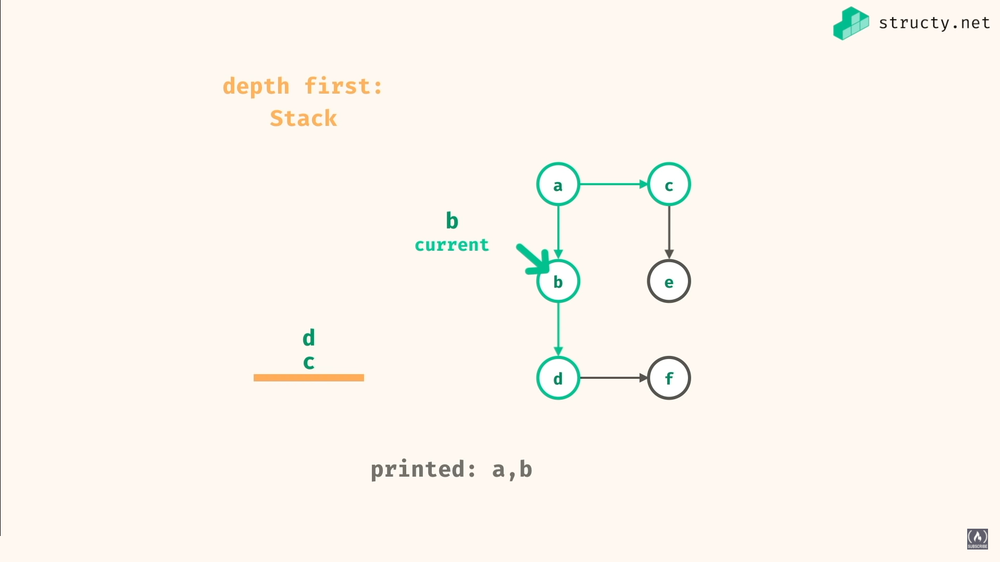
| ------------- | -------------
|  | 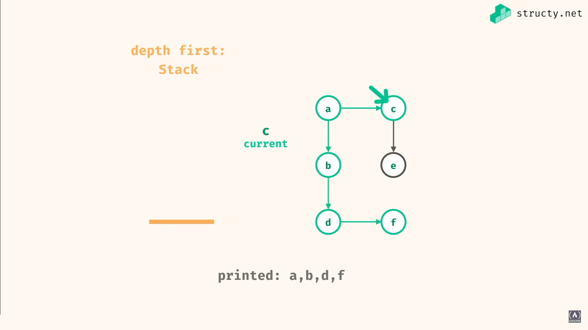 
|  | 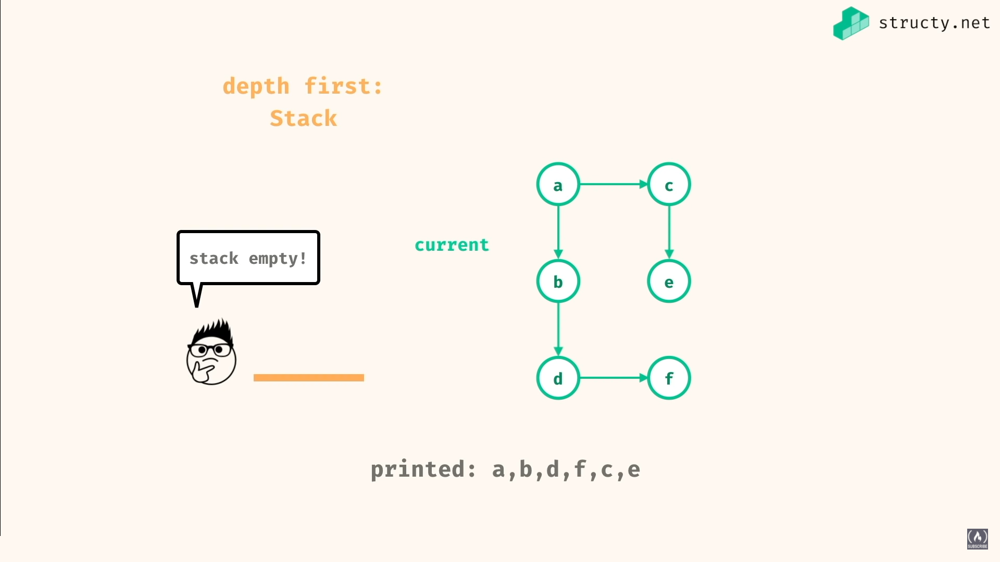

## Breadth

|  | 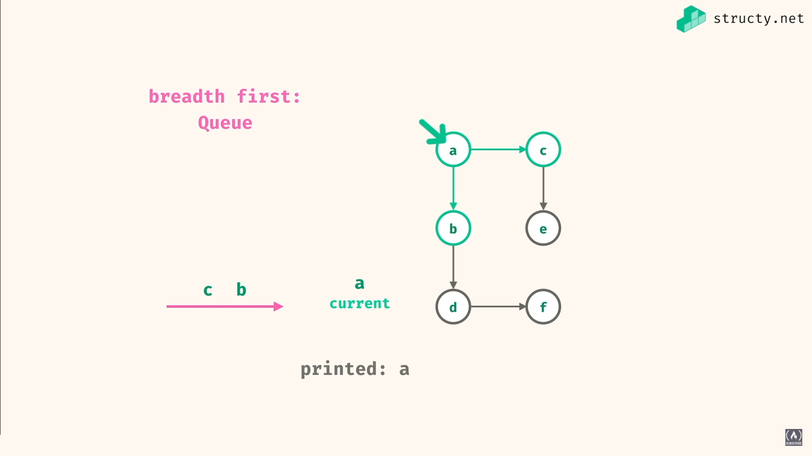
| -------------------------- | ------------
|  | 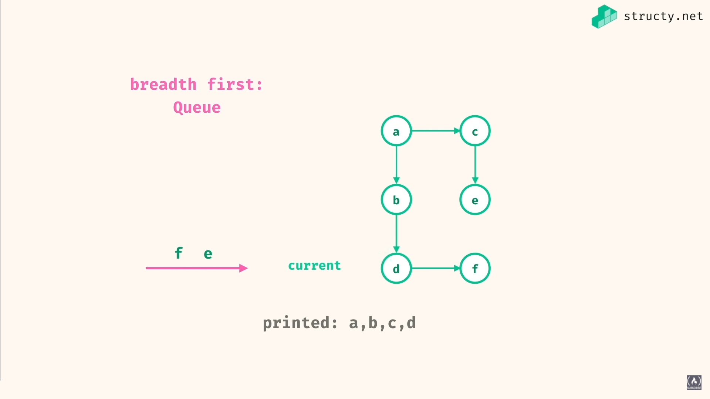

<br>

## Depth first traversal

### JavaScript

```js
const depthFirstPrint = (graph, source) => {
    const stack = [source];

    while (stack.length > 0) {
        const current = stack.pop();
        console.log(current);
        for (let neighbor of graph[current]) {
            stack.push(neighbor);
        }
    }
};

const depthFirstRecursive = (graph, source) => {
    console.log(source);
    for (let neighbor of graph[source]) {
        depthFirstRecursive(graph, neighbor);
    };
};

const graph = {
    a: ['b', 'c'],
    b: ['d'],
    c: ['e'],
    d: ['f'],
    e: [],
    f: []
};


depthFirstPrint(graph, 'a'); // acebdf
console.log();
depthFirstRecursive(graph, 'a'); // abdfce
```

###  C#

```cs
using System;
using System.Collections.Generic;

void DepthFirstPrint(Dictionary<char, List<char>> graph, char source)
{
    Stack<char> stack = new Stack<char>();
    stack.Push(source);
    while (stack.Count > 0)
    {
        char current = stack.Pop();
        Console.Write(current + ", ");
        foreach (char neighbor in graph[current])
        {
            stack.Push(neighbor);
        }
    }
}

void DepthFirstRecursive(Dictionary<char, List<char>> graph, char source)
{
    Console.Write(source + ", ");
    foreach (char neighbor in graph[source])
    {
        DepthFirstRecursive(graph, neighbor);
    }
}

Dictionary<char, List<char>> graph = new Dictionary<char, List<char>>()
{
    ['a'] = new List<char>() { 'b', 'c' },
    ['b'] = new List<char>() { 'd' },
    ['c'] = new List<char>() { 'e' },
    ['d'] = new List<char>() { 'f' },
    ['e'] = new List<char>(),
    ['f'] = new List<char>()
};

DepthFirstPrint(graph, 'a'); //acebdf
Console.WriteLine();
DepthFirstRecursive(graph, 'a'); //abdfce
```

## Breadth first traversal

###  JavaScript

```js
const breadthFirstPrint = (graph, source) => {
    const queue = [source];
    while (queue.length > 0) {
        const current = queue.shift();
        console.log(current);
        for (let neighbor of graph[current]) {
            queue.push(neighbor);
        }
    }
};

const graph = {
    a: ['b', 'c'],
    b: ['d'],
    c: ['e'],
    d: ['f'],
    e: [],
    f: []
};

breadthFirstPrint(graph, 'a'); // abcdef
```

### C#

```cs
using System;
using System.Collections.Generic;

void BreadthFirstPrint(Dictionary<char, List<char>> graph, char source)
{
    Queue<char> queue = new Queue<char>();
    queue.Enqueue(source);
    while (queue.Count > 0)
    {
        char current = queue.Dequeue();
        Console.Write(current + ", ");
        foreach (char neighbor in graph[current])
        {
            queue.Enqueue(neighbor);
        }
    }
    Console.WriteLine(string.Join(", ", queue));
}

Dictionary<char, List<char>> graph = new Dictionary<char, List<char>>()
{
    ['a'] = new List<char>() { 'b', 'c' },
    ['b'] = new List<char>() { 'd' },
    ['c'] = new List<char>() { 'e' },
    ['d'] = new List<char>() { 'f' },
    ['e'] = new List<char>(),
    ['f'] = new List<char>()
};

BreadthFirstPrint(graph, 'a'); //abcdef
```

# Problem solving

## has path - no cycle

|  | 
| -------------------------- | ---------------------
|   | 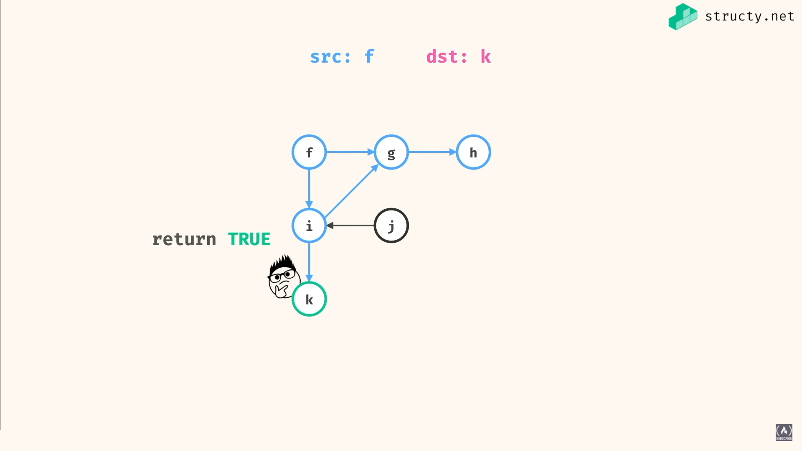
| 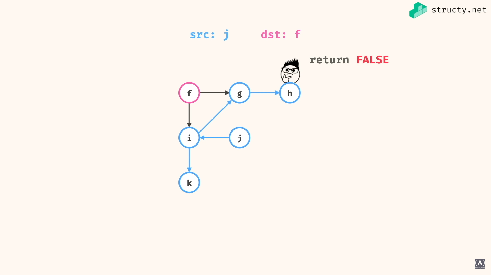 | 

### Depth

```js
const hasPath = (graph, src, dest) => {
    if (src == dest) return true;

    for (let neighbor of graph[src]) {
        if (hasPath(graph, neighbor, dest) == true) {
            return true;
        }
    }

    return false;
};

const graph = {
    f: ['g', 'i'],
    g: ['h'],
    h: [],
    i: ['g', 'k'],
    j: ['i'],
    k: []
};

console.log(hasPath(graph, 'f', 'k')); // true
console.log(hasPath(graph, 'f', 'j')); // false
```

###  Breath

### Depth

```js
const hasPath = (graph, src, dest) => {
    const queue = [];
    queue.push(src);

    while (queue.length > 0) {
       const curr = queue.shift();
        if (curr == dest) return true;
        for (let neighbor of graph[curr]) {
            queue.push(neighbor);
        }
    }

    return false;
};

const graph = {
    f: ['g', 'i'],
    g: ['h'],
    h: [],
    i: ['g', 'k'],
    j: ['i'],
    k: []
};

console.log(hasPath(graph, 'f', 'k')); // true
console.log(hasPath(graph, 'f', 'j')); // false
```

<br>

## undirected path

|  | 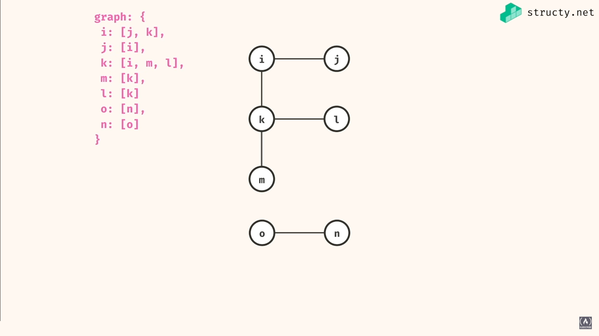
| ------------------------- | -----------
|  | 
|  | 
|  | 
|  | 

<br>

- first we have to convert our edges list into an adjacency list `buildGraph()`

### JS

```js
const undirectedGraph = (edges, nodeA, nodeB) => {
    const graph = buildGraph(edges);
    return hasPath(graph, nodeA, nodeB, new Set());
};

const hasPath = (graph, src, dest, visited) => {
    if (visited.has(src)) return false;
    if (src == dest) return true;
    visited.add(src);
    for (let neighbor of graph[src]) {
        if (hasPath(graph, neighbor, dest, visited) == true) {
            return true;
        }
    }
 
    return false;
};

const buildGraph = (edges) => {
    const graph = {};

    for (let edge of edges) {
        const [a, b] = edge;
        if (!(a in graph)) graph[a] = [];
        if (!(b in graph)) graph[b] = [];
        graph[a].push(b);
        graph[b].push(a);
    }

    return graph;
};

const edges = [
    ['i', 'j'],
    ['k', 'i'],
    ['m', 'k'],
    ['k', 'l'],
    ['o', 'n']
];

console.log(undirectedGraph(edges, 'j', 'm')); // -> true
console.log(undirectedGraph(edges, 'i', 'n')); // -> false
```

### C#

```cs
using System;
using System.Collections.Generic;
using System.Linq;

bool HasPath(List<List<char>> edges, char src, char dest) => 
        HasPathRec(BuildGraph(edges), src, dest, new HashSet<char>());


bool HasPathRec(Dictionary<char, List<char>> graph, char src, char dest, HashSet<char> visited)
{
    if (visited.Contains(src)) return false;
    if (src == dest) return true;

    visited.Add(src);
    foreach (char neighbor in graph[src])
    {
        if (HasPathRec(graph, neighbor, dest, visited) == true)
        {
            return true;
        }
    }

    return false;
}

Dictionary<char, List<char>> BuildGraph(List<List<char>> edges)
{
    var graph = new Dictionary<char, List<char>>();
    foreach (List<char> edge in edges)
    {
        char a = edge[0];
        char b = edge[1];
        if (!graph.ContainsKey(a)) graph.Add(a, new List<char>());
        if (!graph.ContainsKey(b)) graph.Add(b, new List<char>());
        graph[a].Add(b);
        graph[b].Add(a);
    }

    graph.ToList().ForEach(x => Console.WriteLine(x.Key + ": [" + string.Join(", ", x.Value) + "]"));
    return graph;
}

List<List<char>> edges = new List<List<char>>()
{
    new List<char>() {'i', 'j'},
    new List<char>() {'k', 'i'},
    new List<char>() {'m', 'k'},
    new List<char>() {'k', 'l'},
    new List<char>() {'o', 'n'},
};

Console.WriteLine(HasPath(edges, 'i', 'm') + "\n"); //-> True
Console.WriteLine(HasPath(edges, 'i', 'n')); //-> False

```

<br>

## connected components count

|  | 
| ------------------------- | -------
|  | 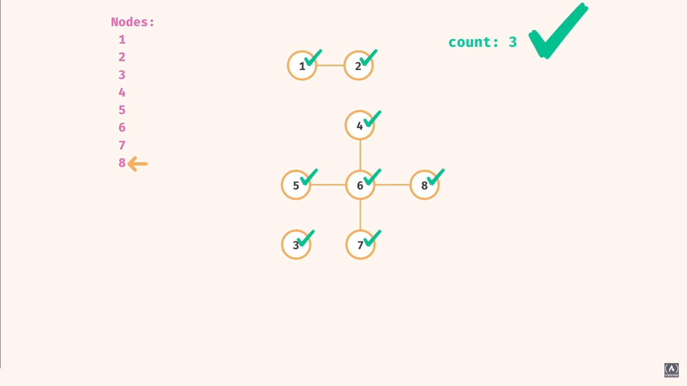

### JS

```js
const connectedComponentsCount = (graph) => {
    const visited = new Set();
    let count = 0;
    for (let node in graph) {
        if (explore(graph, node, visited) == true) {
            count++;
        }
    }

    return count;
}; 

const explore = (graph, current, visited) => {
    if (visited.has(String(current))) return false;

    visited.add(String(current));

    for (let neighbor of graph[current]) {
        explore(graph, neighbor, visited);
    }

    return true;
};

const graph = {
    0: [8, 1, 5],
    1: [0],
    5: [0, 8],
    8: [0, 5],
    2: [3, 4],
    3: [2, 4],
    4: [3, 2]
};

const graph2 = {
    1: [2],
    2: [1],
    3: [],
    4: [6],
    5: [6],
    6: [4, 5, 8, 7],
    7: [6],
    8: [6]
};

console.log(connectedComponentsCount(graph)); // -> 2
console.log(connectedComponentsCount(graph2)); // -> 3
```

### C#

```cs
using System;
using System.Collections.Generic;

int ConnectedComponentsCount(Dictionary<int, List<int>> graph)
{
    HashSet<int> visited = new HashSet<int>();
    int field_count = 0;
    foreach (KeyValuePair<int, List<int>> node in graph)
    {
        if (Explore(graph, node.Key, visited) == true)
        {
            field_count++;
        }
    }
    return field_count;
}

bool Explore(Dictionary<int, List<int>> graph, int current, HashSet<int> visited)
{
    if (visited.Contains(current)) return false;
    visited.Add(current);

    foreach (int neighbor in graph[current])
    {
        Explore(graph, neighbor, visited);
    }

    return true;
}

Dictionary<int, List<int>> graph = new Dictionary<int, List<int>>()
{
    [0] = new List<int>() { 8, 1, 5 },
    [1] = new List<int>() { 0 },
    [5] = new List<int>() { 0, 8 },
    [8] = new List<int>() { 0, 5 },

    [2] = new List<int>() { 3, 4 },
    [3] = new List<int>() { 2, 4 },
    [4] = new List<int>() { 3, 2 }
};

Dictionary<int, List<int>> graph2 = new Dictionary<int, List<int>>()
{
    [1] = new List<int>() { 2 },
    [2] = new List<int>() { 1 },

    [3] = new List<int>(),

    [4] = new List<int>() { 6 },
    [5] = new List<int>() { 6 },
    [6] = new List<int>() { 4, 5, 8, 7 },
    [7] = new List<int>() { 6 },
    [8] = new List<int>() { 6 }
};

Console.WriteLine(ConnectedComponentsCount(graph)); //-> 2
Console.WriteLine(ConnectedComponentsCount(graph2)); //-> 0
```

<br>

## largest component

| 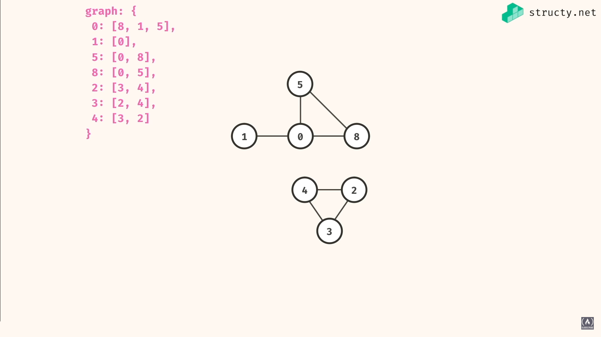 | 
| ------------------------- | -----------------------------

### C#

```cs
using System;
using System.Collections.Generic;

int LargestComponent(Dictionary<int, List<int>> graph)
{
    HashSet<int> visited = new HashSet<int>();
    int max = 0; //size of the largest component
    foreach (KeyValuePair<int, List<int>> node in graph)
    {
        int curr = Explore(graph, node.Key, visited);
        max = curr > max ? curr : max;
    }

    return max;
}

int Explore(Dictionary<int, List<int>> graph, int current, HashSet<int> visited)
{
    if (visited.Contains(current)) return 0;
    visited.Add(current); 
    int field_size = 1;
    foreach (int neighbor in graph[current])
    {
        field_size += Explore(graph, neighbor, visited);
    }

    return field_size;
}

Dictionary<int, List<int>> graph = new Dictionary<int, List<int>>()
{
    [0] = new List<int>() { 8, 1, 5 },
    [1] = new List<int>() { 0 },
    [5] = new List<int>() { 0, 8 },
    [8] = new List<int>() { 0, 5 },

    [2] = new List<int>() { 3, 4 },
    [3] = new List<int>() { 2, 4 },
    [4] = new List<int>() { 3, 2 }
};

Dictionary<int, List<int>> graph2 = new Dictionary<int, List<int>>()
{
    [1] = new List<int>() { 2 },
    [2] = new List<int>() { 1 },

    [3] = new List<int>(),

    [4] = new List<int>() { 6 },
    [5] = new List<int>() { 6 },
    [6] = new List<int>() { 4, 5, 8, 7 },
    [7] = new List<int>() { 6 },
    [8] = new List<int>() { 6 }
};

Console.WriteLine(LargestComponent(graph)); //-> 4
Console.WriteLine(LargestComponent(graph2)); //-> 5
```

<br>

## shortest path

| 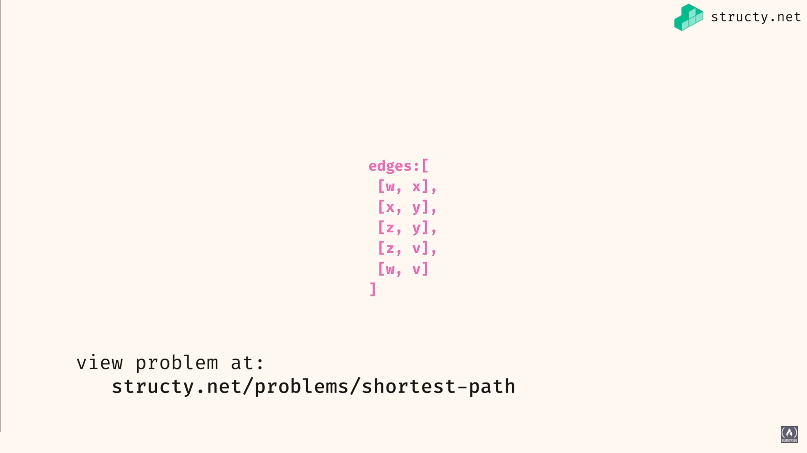 | 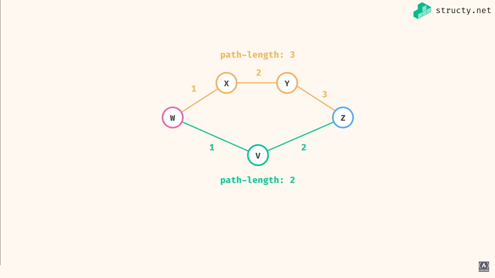
| ------------------------- | ------------
|  | 

**Breath first is better in this case, depth first could be unlucky**

| 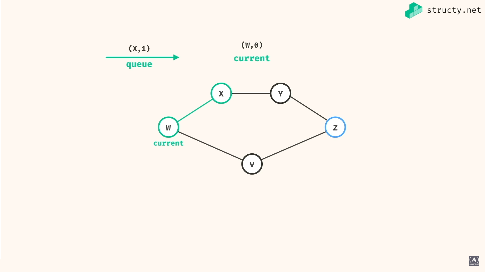 | 
| --------------------------| -----------
| 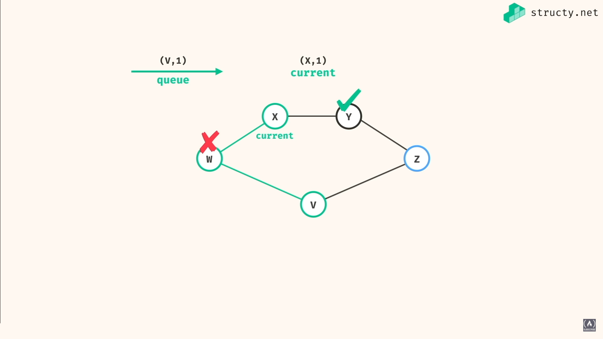 | 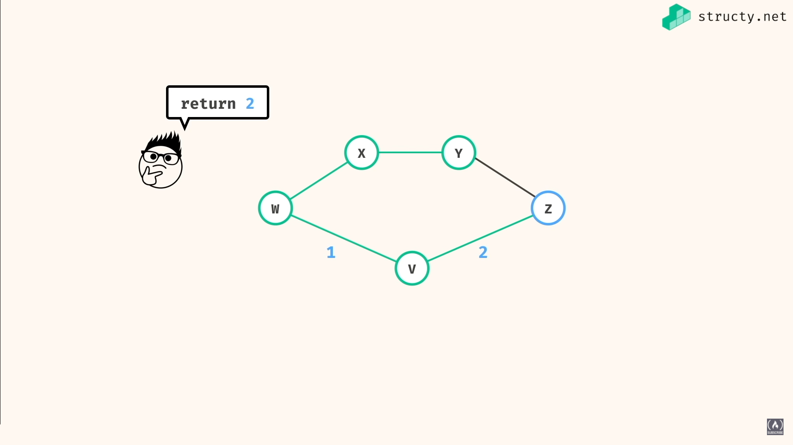

### C#

```cs
using System;
using System.Collections.Generic;
using System.Linq;

int ShortestPath(List<List<char>> edges, char src, char dest)
{
    var graph = BuildGraph(edges);
    var queue = new Queue<KeyValuePair<char, int>>(); //('V', 1)
    queue.Enqueue(new KeyValuePair<char, int>(src, 0));

    var visited = new HashSet<char>(src);
    while (queue.Count > 0)
    {
        var curr = queue.Dequeue();
        if (curr.Key == dest) return curr.Value; //find the shortes path

        foreach (var neighbor in graph[curr.Key])
        {
            if (!visited.Contains(neighbor))
            {
                visited.Add(neighbor);
                queue.Enqueue(new KeyValuePair<char, int>(neighbor, curr.Value + 1));
            }
        }
    }

    return -1; //no path
}

Dictionary<char, List<char>> BuildGraph(List<List<char>> edges)
{
    var graph = new Dictionary<char, List<char>>();
    foreach (List<char> edge in edges)
    {
        char a = edge[0];
        char b = edge[1];
        if (!graph.ContainsKey(a)) graph.Add(a, new List<char>());
        if (!graph.ContainsKey(b)) graph.Add(b, new List<char>());
        graph[a].Add(b);
        graph[b].Add(a);
    }

    graph.ToList().ForEach(x => Console.WriteLine(x.Key + ": [" + string.Join(", ", x.Value) + "]"));
    return graph;
}

var edges = new List<List<char>>()
{
    new List<char>() { 'w', 'x' },
    new List<char>() { 'x', 'y' },
    new List<char>() { 'z', 'y' },
    new List<char>() { 'z', 'v' },
    new List<char>() { 'w', 'v' }
};

var edges_cycle = new List<List<char>>()
{
    new List<char>() { 'w', 'x' },
    new List<char>() { 'x', 'y' },
    new List<char>() { 'z', 'y' },
    new List<char>() { 'w', 'v' },
    new List<char>() { 'v', 'y' }
};

var edges_cycle_noPath = new List<List<char>>()
{
    new List<char>() { 'w', 'x' },
    new List<char>() { 'x', 'v' },
    new List<char>() { 'v', 'w' },
};

Console.WriteLine(ShortestPath(edges, 'w', 'z') +  "\n"); //-> 2
Console.WriteLine(ShortestPath(edges_cycle, 'w', 'z')); //-> 3
Console.WriteLine(ShortestPath(edges_cycle_noPath, 'w', 'z')); //-> -1  no such path
```

<br>

## island problems

### island count

| 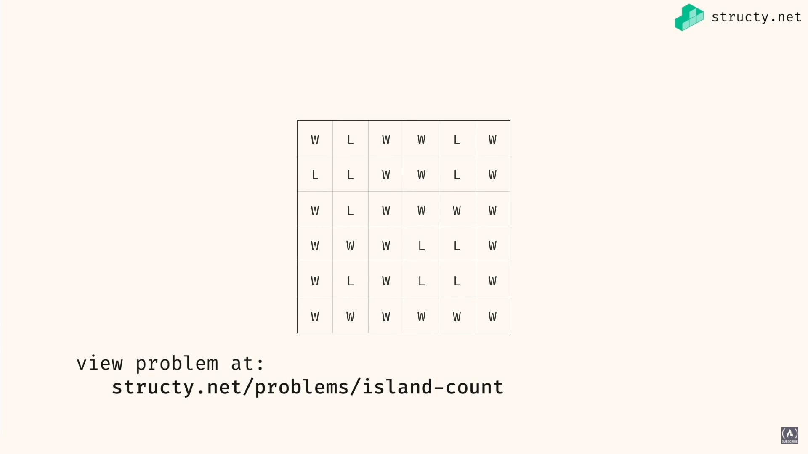| 
| ------------------------- | ------------------------
| 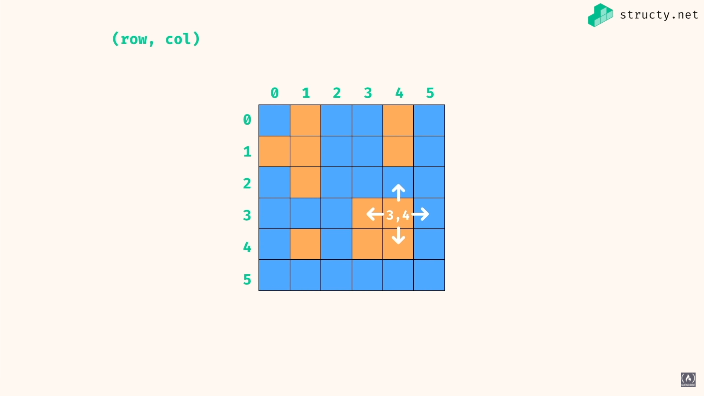 | 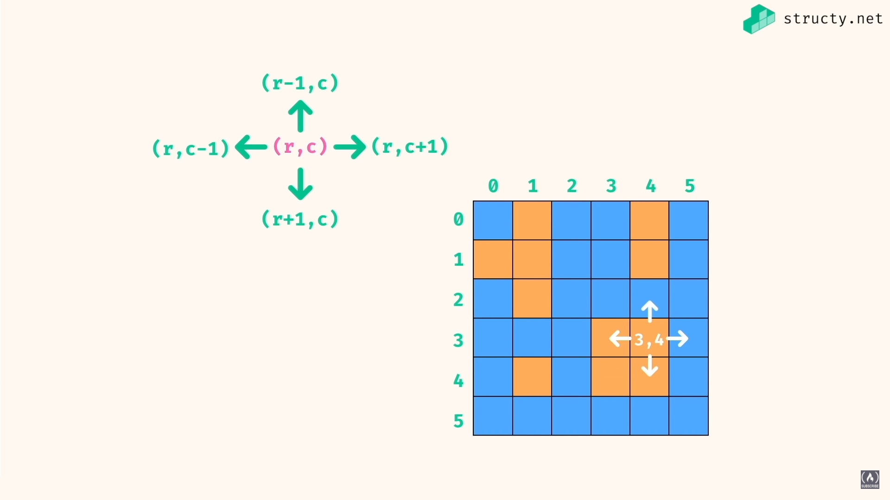
| 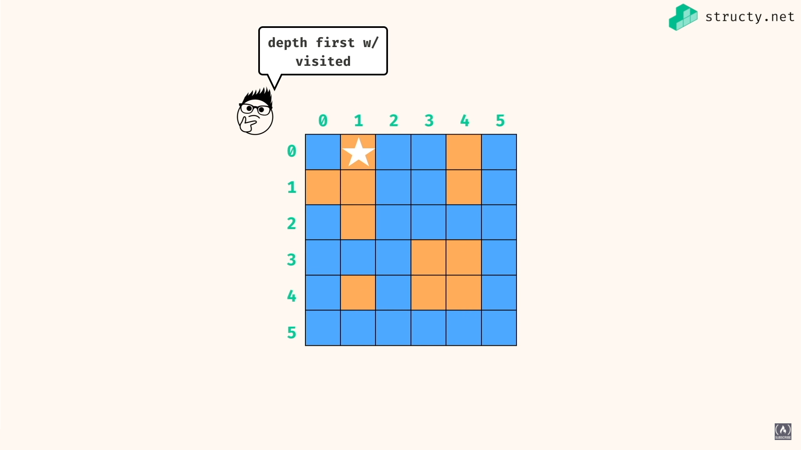 | 

**L - Land**

**W - Water**

```cs
using System;
using System.Collections.Generic;

int IslandCount(List<List<char>> grid)
{
    int island_count = 0;
    for (int i = 0; i < grid.Count; i++)
    {
        for (int j = 0; j < grid[i].Count; j++)
        {
            if (grid[i][j] == 'L')
            {
                Explore(grid, i, j);
                island_count++;
            }
        }
    }

    return island_count;
}

void Explore(List<List<char>> grid, int i, int j) //Depth First
{
    if (i < 0 || j < 0 || i >= grid.Count ||
        j >= grid[i].Count || grid[i][j] == 'W') return;

    grid[i][j] = 'W'; //HashSet<string> visited.Add(i + "," + j);
    Explore(grid, i - 1, j);
    Explore(grid, i, j + 1);
    Explore(grid, i, j - 1);
    Explore(grid, i + 1, j);
}

var grid = new List<List<char>>()
{
    new List<char>() { 'W', 'L', 'W', 'W', 'L' },
    new List<char>() { 'W', 'L', 'W', 'W', 'W' },
    new List<char>() { 'W', 'W', 'W', 'L', 'W' },
    new List<char>() { 'W', 'W', 'L', 'L', 'W' },
    new List<char>() { 'L', 'W', 'W', 'L', 'L' },
    new List<char>() { 'L', 'L', 'W', 'W', 'W' }
};

Console.WriteLine(IslandCount(grid)); //-> 4
```

### largest/maximum island

```cs
using System;
using System.Collections.Generic;

int IslandCount(List<List<char>> grid)
{
    int max = 0;
    for (int i = 0; i < grid.Count; i++)
    {
        for (int j = 0; j < grid[i].Count; j++)
        {
            if (grid[i][j] == 'L')
            {
                int current = Explore(grid, i, j);
                max = current > max ? current : max;
            }
        }
    }

    return max;
}

int Explore(List<List<char>> grid, int i, int j) //Depth First
{
    if (i < 0 || j < 0 || i >= grid.Count ||
        j >= grid[i].Count || grid[i][j] == 'W') return 0;

    grid[i][j] = 'W'; //HashSet<string> visited.Add(i + "," + j);
    int field_count = 1;
    field_count += Explore(grid, i - 1, j);
    field_count += Explore(grid, i, j + 1);
    field_count += Explore(grid, i, j - 1);
    field_count += Explore(grid, i + 1, j);

    return field_count;
}

var grid = new List<List<char>>()
{
    new List<char>() { 'W', 'L', 'W', 'W', 'L' },
    new List<char>() { 'W', 'L', 'W', 'W', 'W' },
    new List<char>() { 'W', 'W', 'W', 'L', 'W' },
    new List<char>() { 'W', 'W', 'L', 'L', 'W' },
    new List<char>() { 'L', 'W', 'W', 'L', 'L' },
    new List<char>() { 'L', 'L', 'W', 'W', 'W' }
};

Console.WriteLine(IslandCount(grid)); //-> 5
```

similar problem: https://www.hackerrank.com/challenges/connected-cell-in-a-grid/problem

<br>

**Ende.**

**Reference: https://youtu.be/tWVWeAqZ0WU**
<br>
<br>
<br>