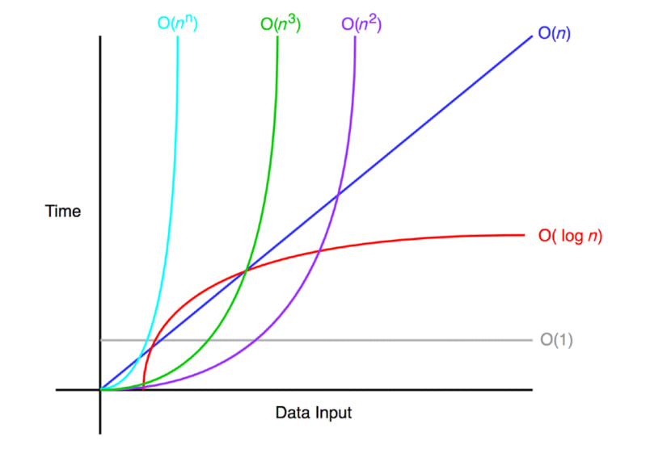

# Data Structures

Main References:
- https://www.youtube.com/watch?v=RBSGKlAvoiM&t=14080s

## Big-O Notation




- How much `time` does this algorithm need to finish?
- How much `space` does this algorithm need for its computation?

Big O Notation gives an upper bound of the complexity in the `worst` case. <br>
This helps to quantify performance as the input size becomes `arbitrarily large`.

`n` - The size of the input <br>
Complexities ordered in from smallest to largest

| Time | Complexity
| ----- | -----------
| Constant | `O(1)`
| Logarithmic | `O(log(n))`
| Linear | `O(n)`
| Linearithmic | `O(nlog(n))`
| Quadric | `O(n^2)`
| Cubic | `O(n^3)`
| Exponential | `O(b^n), b > 1`
| Factorial | `O(n!)`

### Examples

The following run in `constant` time: `O(1)`

```java
a := 1 
b := 2 
c := a + 5*b 

i := 0
while i < 11 do 
    i = i + 1
```

The following run in `linear` time: `O(n)`

```java
i := 0
while i < n do
    i = i + 1

f(n) = n
O(f(n)) = O(n)

---

i = 0
while i < n do
    i = i + 1

f(n) = n/3
O(f(n)) = O(n)
```

```java
i := 0
while i < n do
    j := 0
    while j < 3*n do
        j = j + 1
    j := 0
    while j < 2*n do
        j = j + 1
    i = i + 1

f(n) = n * (3*n + 2*n) = 5n^2
O(f(n)) = O(n^2)
```

The following run in `quadric` time: `O(n^2)`

```java
for(i := 0; i < n; i = i + 1)
    for(j := 0; j < n; j = j + 1)
        
f(n) = n*n = n^2, O(f(n)) = O(n^2)

for(i := 0; i < n; i = i + 1)
    for(j := i; j < n; j = j + 1)

f(n) = n*n = n^2, O(f(n)) = O(n^2)
```

The following run in `logaritmic` time: `O(log(n))`

Suppose we have a sorted array, and we want to find the index of a particular value in the array, if it exists.

```java
low := 0
high := 1
while low <= high do
    mid := (low + high) / 2
    if array[mid] == value: return mid
    else if array[mid] < value: lo = mid + 1
    else value: hi = mid - 1
return -1 // Value not found
```

More examples

```java
i := 0
while i < 3*n do
    j := 10
    while j <= 50 do
        j = j + 1
    j := 0
    while j < n*n*n do
        j = j + 2
    i = i + 1

f(n) = 3n * (40 + (n^3/2))
O(f(n)) = O(n^4)
```

- Finding all subsets of a set - `O(2^n)`
- Finding all permutation of a string - `O(n!)`
- Sorting using mergesort - `O(nlog(n))`
- Iterating over all the cells in a matrix of size n by m - `O(n*m)`

## Static and Dynamic Arrays

Complexity

| operation | Static Array | Dynamic Array
| ---------- | ---------- | --------------
| Access | `O(1)` | `O(1) `
| Search | `O(n)` | `O(n) `
| Insertion | `N/A` | `O(n) `
| Appending | `N/A` | `O(1) `
| Deletion | `N/A` | `O(n) `


<br>
<br>
<br>
<br>
<br>